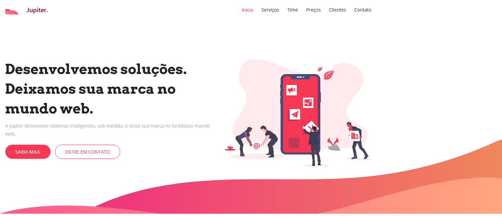
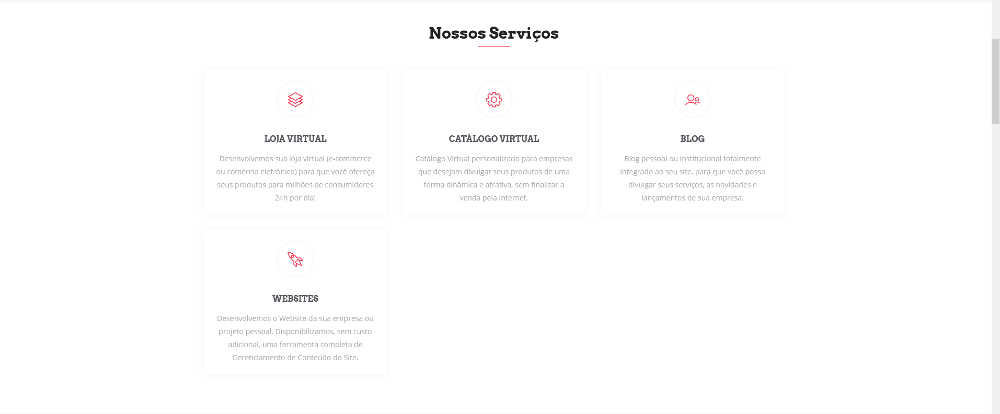
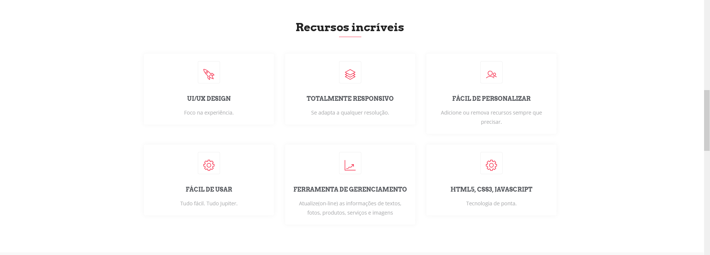
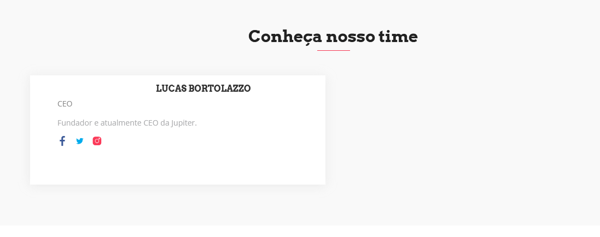
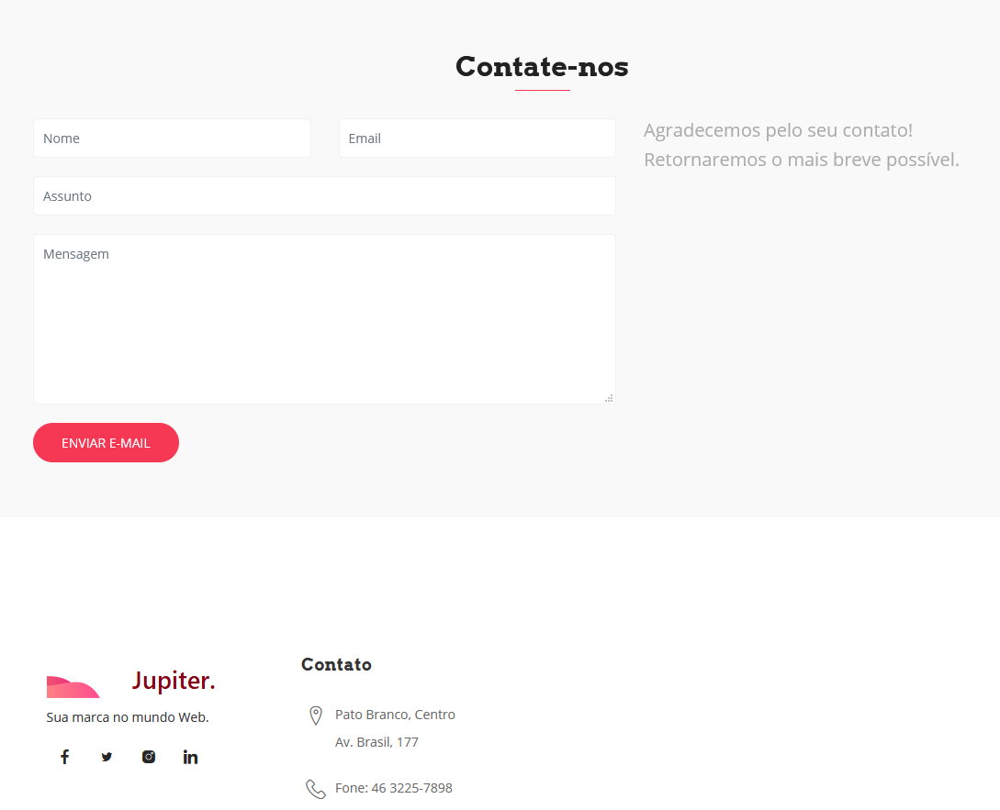
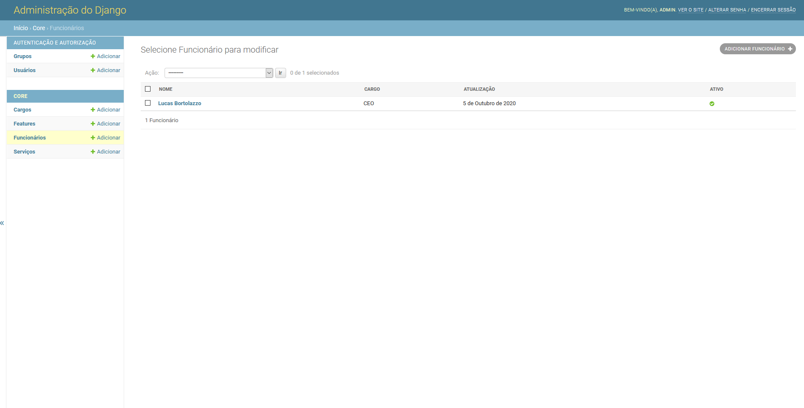

# Jupiter Startup - Projeto para estudo

Projeto de startup de desenvolvimento de softwares. Desenvolvido com Python e Django.
Este projeto foi desenvolvido por Lucas Bortolazzo durante o curso "Programação Web com Python e Django Framework: Essencial da Geek University".

## Features

1. Cadastro de Cargos renderizados em tempo real
2. Cadastro de Features renderizados em tempo real
3. Cadastro de Funcionários renderizados em tempo real
4. Cadastro de Serviços renderizados em tempo real

## Preview

### Página principal
 

### Serviços
 

### Recursos
 

### Time
 

### Contato
 

### Painel de Administração Django
 

## Demo
[Acessar: jupitersoft.com](https://jupitersoft.herokuapp.com/)
 
## Main requirements

* Django==3.1.1
* asgiref==3.2.10
* dj-database-url==0.5.0
* dj-static==0.0.6
* django-stdimage==5.1.1
* gunicorn==20.0.4
* Pillow==7.2.0
* progressbar2==3.53.1
* psycopg2==2.8.6
* psycopg2-binary==2.8.6
* python-utils==2.4.0
* pytz==2020.1
* six==1.15.0
* sqlparse==0.3.1
* static3==0.7.0 
